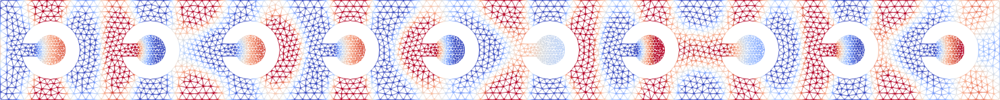

<div align="center">

# Helmholtz-Sonic-Crystals



Data generation for acoustic sonic crystals using the helmholtz equation.

[](https://www.python.org/downloads/release/python-3100/)
[](https://jakobeliaswagner.github.io/Helmholtz-Sonic-Crystals/_static/codecov/index.html)
[](https://jakobeliaswagner.github.io/Helmholtz-Sonic-Crystals/index.html)
[](https://www.linkedin.com/in/jakob-wagner-65b9871a9/)
</div>


## Setup

Install the required packages and libraries

```shell
conda env create -f environment.yml
conda env activate helmholtz-solver
pip install -e .
```

## Hooks

Install the git hook scripts

```shell
pre-commit install
```

now `pre-commit` will run automatically on `git commit `.

## Tests

Ensure the `test` optional dependencies are installed.
Run tests with

```shell
pytest test/
```

## Documentation

The documentation of this project can be read [here](https://jakobeliaswagner.github.io/Helmholtz-Sonic-Crystals/index.html).

Ensure the `doc` optional dependencies are installed.
To build the documentation locally run

```shell
pytest --cov=src/nos --cov-report html:doc/source/_static/codecov test/
sphinx-apidoc -f -o doc/source/ hsc
sphinx-build -M html doc/source doc/build
```

These commands build a coverage report for the project, automatically documents the project using docstrings and builds
the documentation.
The build documentation can then be found in `doc/build/html`. Open the `index.html` to access it.
